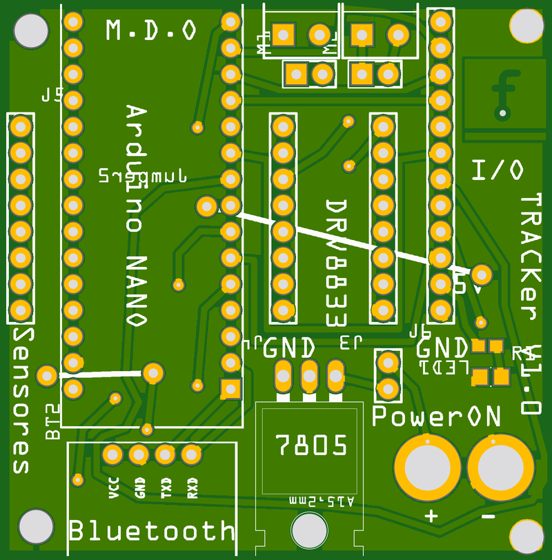
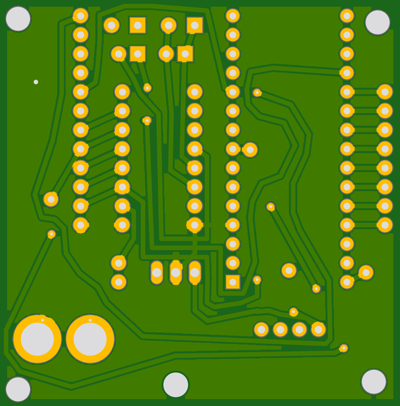

# V2 Seguidor

## About This Project

_Arduino tracker car_

-&gt; Zumo array ir sensor

-&gt; HC -06 Bluetooth

-&gt; And polu DRV8833 drive motor

-&gt; Arduino nano.

## Renderings

### Top

### Bottom

## BOM

|Count|Component|Details|Datasheet|
|-|-|-|-|
|1x|LED1|LED BLUE CLEAR 0603 SMD|[Link](http://optoelectronics.liteon.com/upload/download/DS22-2000-230/LTST-C191TBKT.pdf)|
|2x|M1 / M2|IC MOTOR DRIVER PAR 8WSON|[Link](http://www.ti.com/lit/ds/symlink/drv8837.pdf)|
|2x|J1 / J2|TERM SCREW 4-40 4 PIN PCB RA|[Link](http://www.keyelco.com/product-pdf.cfm?p=1094)|
|1x|IC1|IC REG LDO 5V 1.5A TO220-3|[Link](http://www.ti.com/lit/ds/symlink/tl780.pdf)|

---

This project is managed and available on

You can view it [here](https://aisler.net/p/IUGGQLEE). Start your own Powerful Prototype on [here](https://aisler.net).
